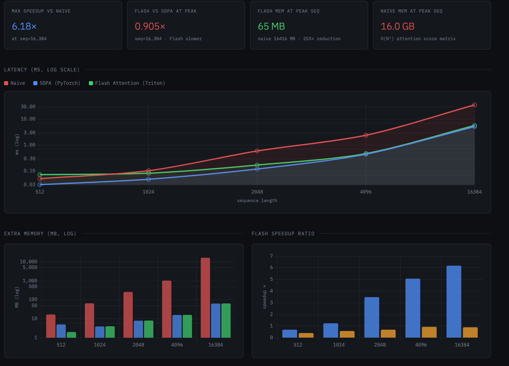
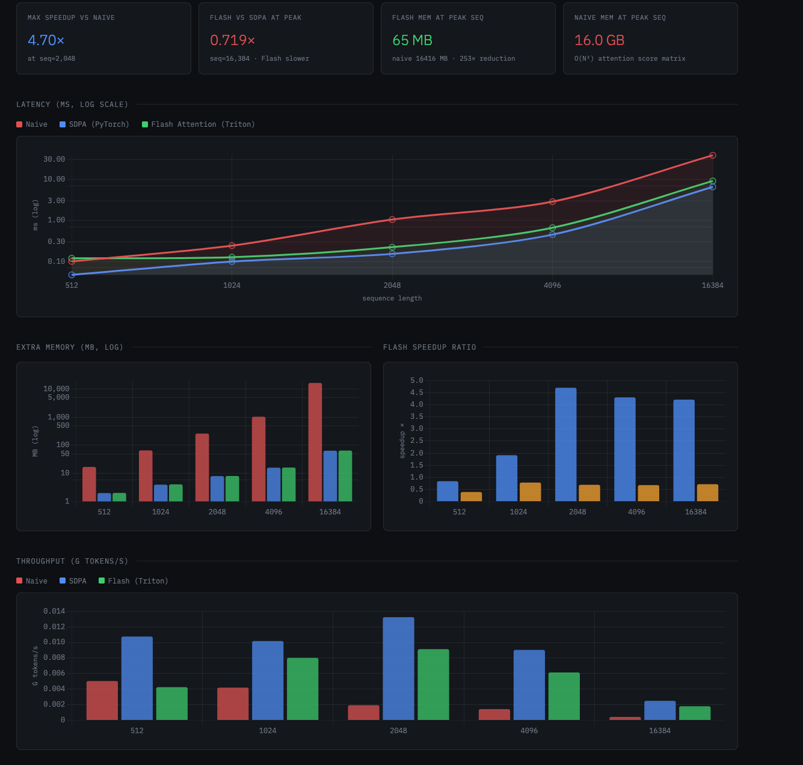
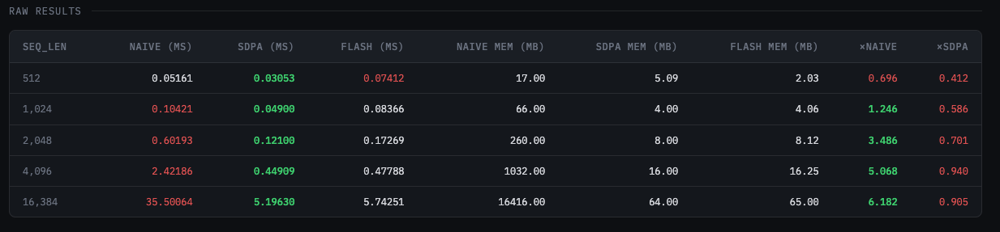
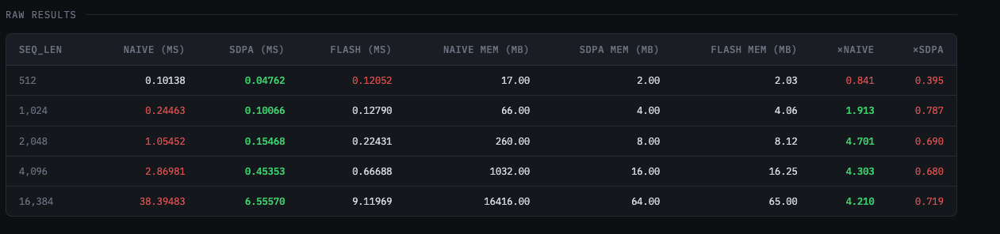

# FlashAttention 的 Triton 实现（从零开始）

## 项目简介

为深度理解 FlashAttention 的原理细节，本项目从零手动实现了 FlashAttention 的 PyTorch 版与 Triton 版，核心实现了以下机制：

- **Tiling（分块计算）**：将 Q/K/V 分块载入 SRAM，避免将完整 attention matrix 写回 HBM
- **Online Softmax**：使用数值稳定的 online softmax，支持在单次遍历中完成归一化
- **IO-Aware 设计**：减少 HBM 读写次数，显著降低内存带宽瓶颈

并与标准 Attention 及 PyTorch SDPA 进行了速度、显存、吞吐量性能对比。

## 项目结构
```
.
├── attention/
│   ├── flash_attention_torch.py        # FlashAttention 前向传播 PyTorch 版实现
│   ├── flash_attention_triton.py       # FlashAttention 前向传播 Triton 版实现
│   └── naive_attention.py              # 标准 Attention 实现（基准对比）
├── results/
│   ├── **.json                         # Benchmark 测试结果（JSON 格式）
│   └── **.html                         # Benchmark 结果可视化报告
├── utils/
│   └── plot_benchmark.py                # 自动化绘图脚本 (生成对比曲线图)
├── benchmark.py                         # 性能对比主脚本 (Time, Memory, Thoughput)
└── README.md                            # 项目文档
```
---

## 环境依赖

| 依赖 | 推荐版本 |
|------|----------|
| Python | >= 3.9 |
| PyTorch | >= 2.0 |
| Triton | >= 2.1 |
| CUDA | >= 11.8 |

安装依赖：

```bash
pip install torch triton
```

---

## 快速开始

### 1. 克隆仓库

```bash
git clone https://github.com/your-username/flash-attention-triton.git
cd flash-attention-triton
```

### 2. 运行 Benchmark

```bash
python benchmark.py --seq_len 512 1024 2048 4096 16384
```

### 3. 可视化结果

```bash
python utils/plot_benchmark.py results/flash_benchmark_<timestamp>.json --out report.html
```

---
  
## 性能表现 (Benchmark)

<div align="center">
  
  
  <br>
  <em>GPU 5090 VS A800 性能对比曲线</em>
</div>  

### 详细数据

<div align="center">
  
  <br>
  <em>GPU 5090</em>
</div>

<div align="center">
  
  <br>
  <em>GPU A800</em>
</div>

## TODO

| 状态 | 任务 |
|------|------|
| 🔲 计划中 | Profiling 性能瓶颈分析 |
| 🔲 计划中 | 添加反向传播 Triton 实现 |
| 🔲 计划中 | 添加 RoPE Kernel |
| 🔲 计划中 | 性能进一步优化（shared memory、warp 级优化等）|
## 参考文献

- [FlashAttention: Fast and Memory-Efficient Exact Attention with IO-Awareness](https://arxiv.org/abs/2205.14135) — Dao et al., 2022
- [FlashAttention-2: Faster Attention with Better Parallelism and Work Partitioning](https://arxiv.org/abs/2307.08691) — Dao, 2023